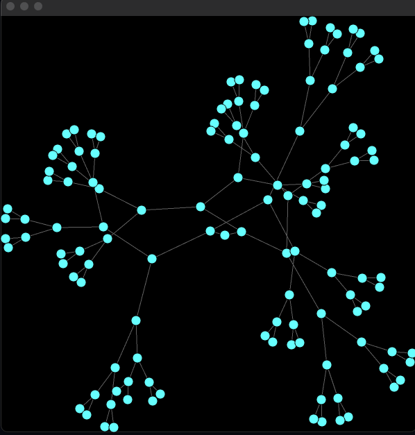

# CS106L Assign 1: GraphViz


My implementation of CS106L Assignment 1: GraphViz


## Usage 

### Install dependency

Run following command to install dependency
```
sudo apt install qtbase5-dev
```

### Build the Program

Run the following command to build program
```
qmake GraphViz.pro
make all
```

### Run the Program

Run the followiing command to run the program
```
./GraphViz
```